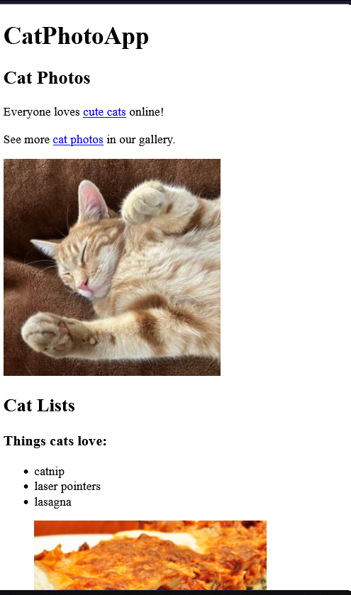
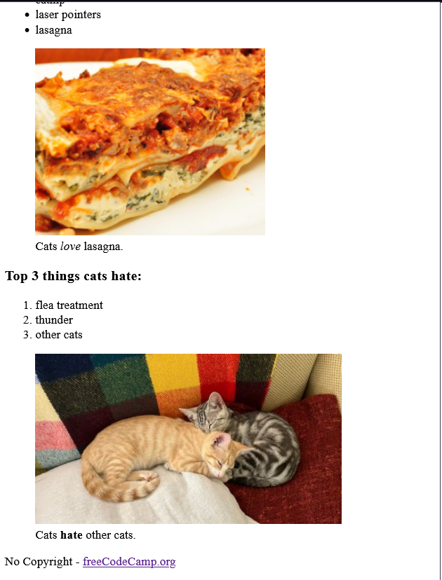

HTML stands for HyperText Markup Language and it represents the content and structure of a web page.

In this workshop, you will learn how to work with basic HTML elements such as headings, paragraphs, images, links, and lists.

