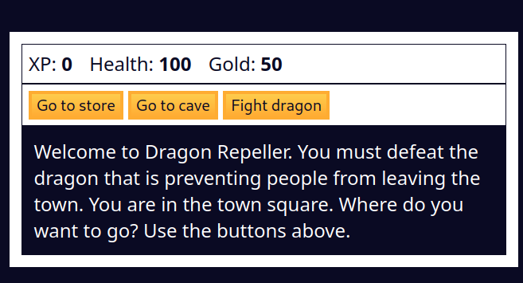
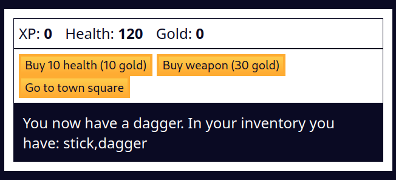
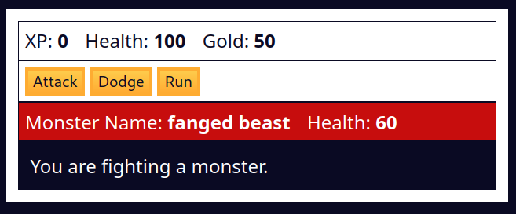
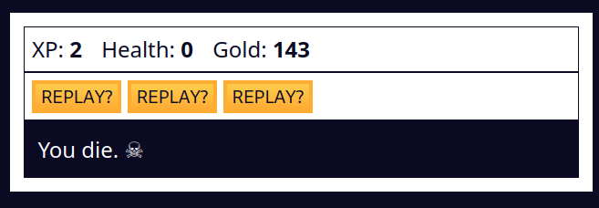
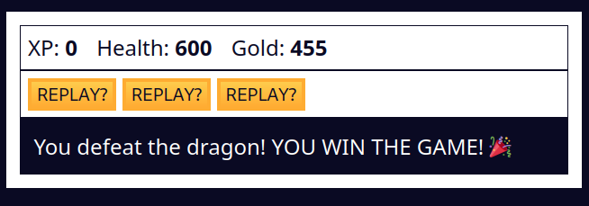

JavaScript is a powerful scripting language that you can use to make web pages interactive. It's one of the core technologies of the web, along with HTML and CSS. All modern browsers support JavaScript.

In this practice project, you'll learn fundamental programming concepts in JavaScript by coding your own Role Playing Game. You'll learn how to work with arrays, strings, objects, functions, loops, if/else statements, and more.

