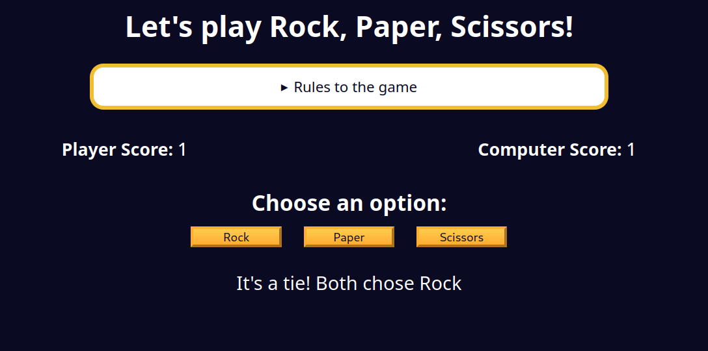

## Updating the Scores and Round Results Message

Now it is time to update the scores and the round results message.

Complete the `showResults` function. The `playerScoreSpanElement` and `computerScoreSpanElement` should be updated to show the updated scores of the player and computer.

The `roundResultsMsg` should also be updated with the result of the round.

### Tips
- Remember that you learned how to work with the `innerText` property to update the text content of an element.
- You can use the `getRoundResults` function to get the result of the round.

