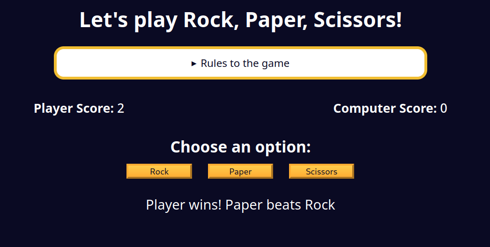

## Implementing Game Win Conditions

If you try to play the game, you will see that you can play for an infinite amount of rounds. But the rules state that the first one to three points wins.

Inside your `showResults` function, you will need to check if the player or computer has reached three points. If either has reached three points, you should display a message indicating the winner.

For example, if the player has won the game, then the `winnerMsgElement` should be updated to "Player has won the game!". If the computer has won the game, then the `winnerMsgElement` should be updated to "Computer has won the game!".

If there is a winner, you will want to show the `resetGameBtn` button and hide the `optionsContainer` so the player can play again.

### Tips
- Use the `style.display` property on an element, with the value "block" or "none", to show or hide the element.

