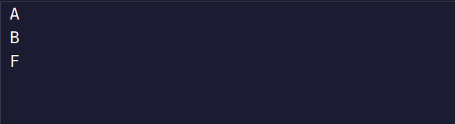

# Convert Score to Letter Grade

Now the teacher needs your help converting the student score to a letter grade.

Complete the `getGrade` function that takes a number score as a parameter. Your function should return a string representing a letter grade based on the score.

### Scores and Their Corresponding Letter Grades:

| Score Range | Grade |
|-------------|-------|
| 100         | "A++" |
| 90 - 99     | "A"   |
| 80 - 89     | "B"   |
| 70 - 79     | "C"   |
| 60 - 69     | "D"   |
| 0 - 59      | "F"   |

### Tips:
- Remember that you learned about conditional statements (`if`, `else if`, and `else`).
- Remember that you learned about comparison operators (`>`, `<`, `>=`, `<=`, `===`).

