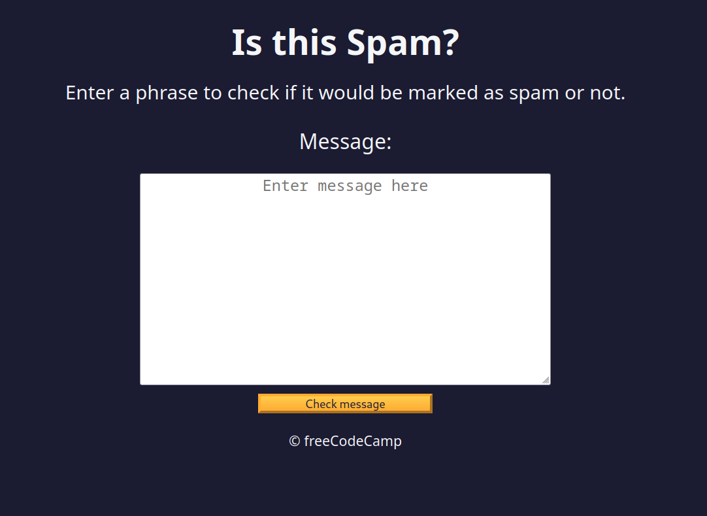
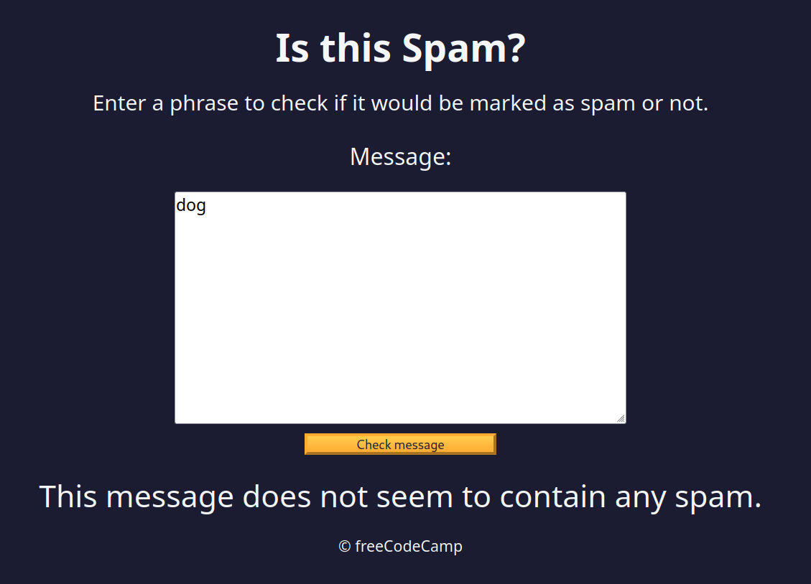
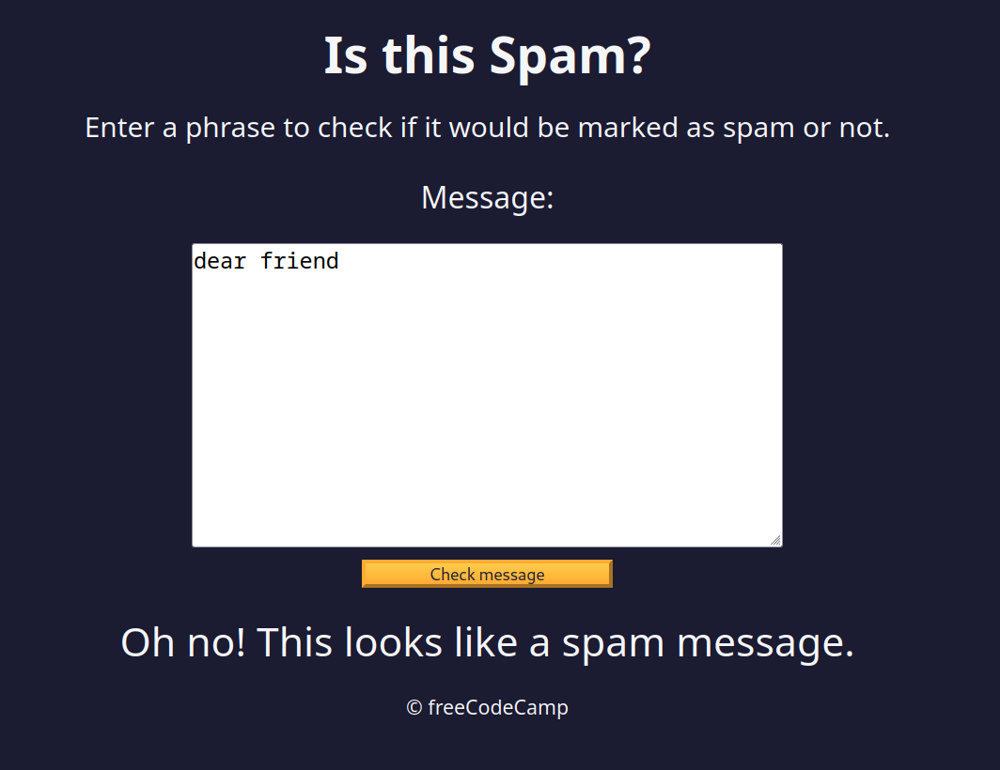

Regular expressions, often shortened to "regex" or "regexp", are patterns that help programmers match, search, and replace text. Regular expressions are powerful, but can be difficult to understand because they use so many special characters.

In this spam filter project, you'll learn about capture groups, positive lookaheads, negative lookaheads, and other techniques to match any text you want.

