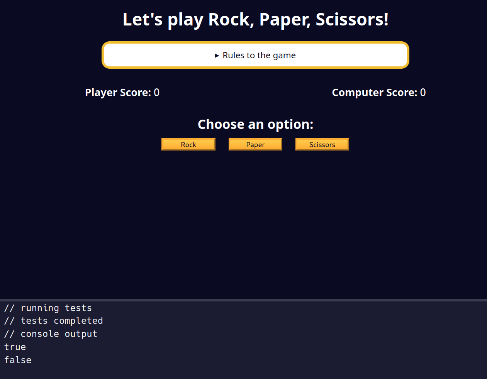

## Determining the Winner of Each Round

### Instructions
In the game, there will be multiple rounds. The first to reach three points wins the game.

In this step, you will focus on determining if the player has won the round.

Complete the `hasPlayerWonTheRound` function. This function has two parameters: `player` and `computer`. The function should return `true` if the player has won the round, and `false` if the player has lost or tied the round.

### Criteria for Player to Win:
- If the player chooses "Rock" and the computer chooses "Scissors"
- If the player chooses "Scissors" and the computer chooses "Paper"
- If the player chooses "Paper" and the computer chooses "Rock"

A few function calls have been provided for you to test your function.

