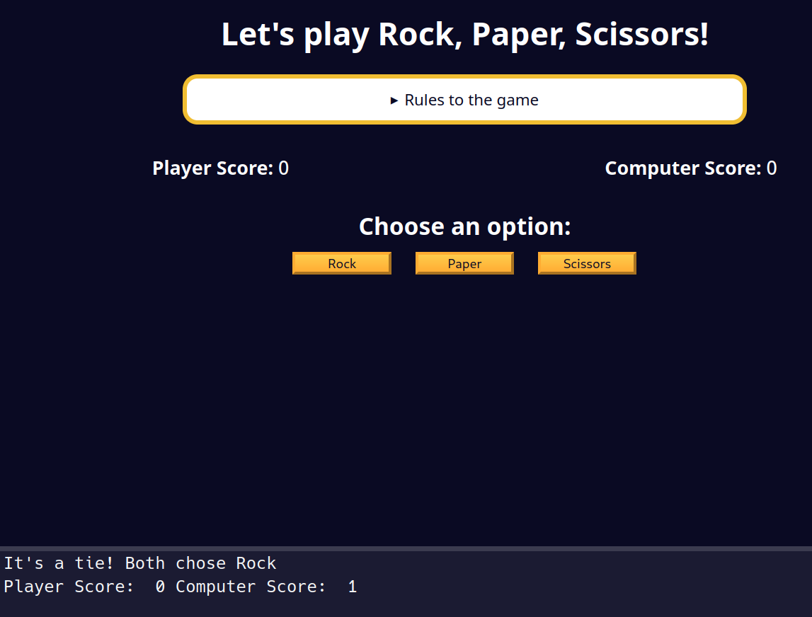

## Getting the Results of the Round
Now it is time to get the results of the round. Complete the `getRoundResults` function.

If the player wins the round, update the `playerScore` by `1` and return the message `"Player wins! [player's choice] beats [computer's choice]"`.

If the computer and player choose the same option, return the message `"It's a tie! Both chose [player's choice]"`.

If the computer wins the round, update the `computerScore` by `1` and return the message `"Computer wins! [computer's choice] beats [player's choice]"`.

`[computer's choice]` should be replaced with `computerResult` while `[player's choice]` should be replaced with the `userOption`.

### Tips
- Remember you can use the `hasPlayerWonTheRound` function to check if the player wins the round.
- You can use template literals or regular string concatenation to build the message.

