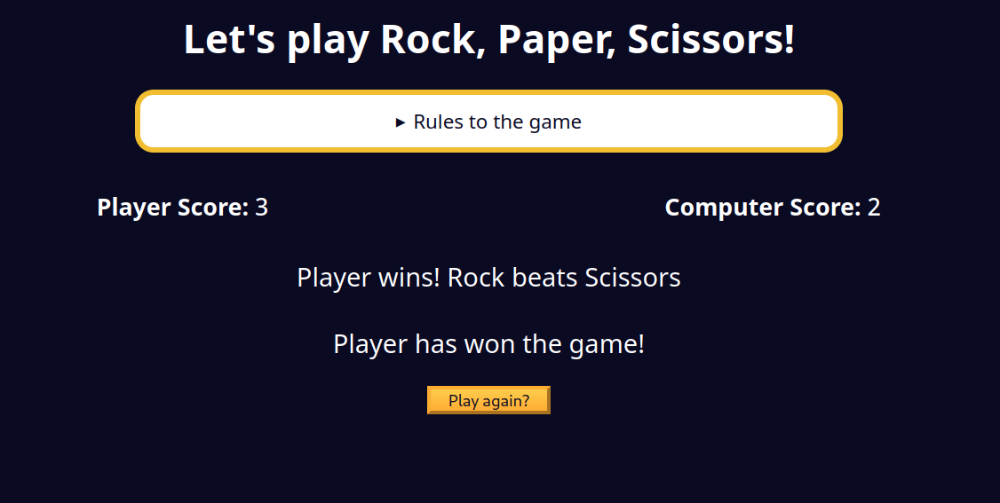

## Completing the Rock, Paper, Scissors Game

### Instructions
If the player or computer has won the game, there should be an option to reset the game and play again. Complete the `resetGame` function that accomplishes the following:

1. Resets the player and computer scores to 0.
2. Updates the `playerScoreSpanElement` and `computerScoreSpanElement` to display the new scores.
3. Hides the `resetGameBtn` button.
4. Shows the `optionsContainer` so the player can play again.
5. Clears the content for the `winnerMsgElement` and `roundResultsMsg` elements.

### Tips
- You can use the `innerText` property to update the content of an element.
- To clear the content of an element, you can set the `innerText` to an empty string.

