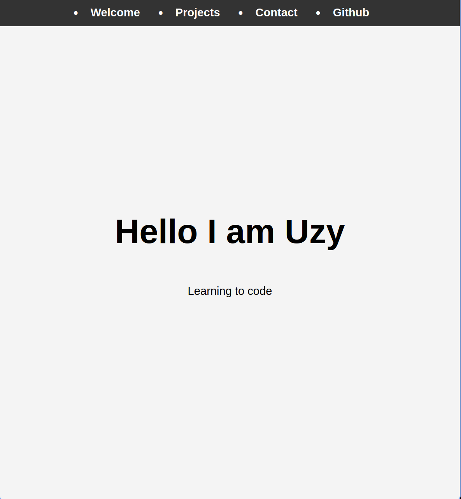
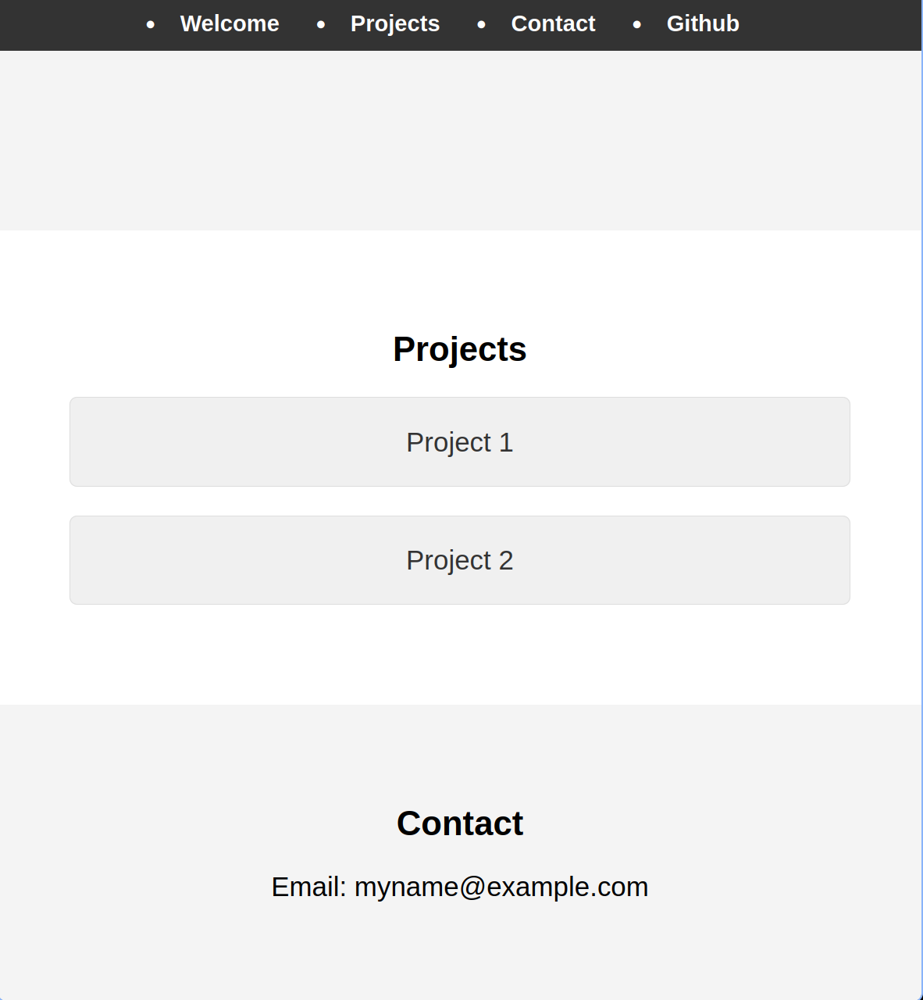

# Build a Personal Portfolio Webpage

For this project, you will build a personal portfolio webpage to showcase your projects and skills.

**Objective:**  
Build an app that is functionally similar to [this personal portfolio webpage](https://personal-portfolio.freecodecamp.rocks). Do not copy this demo project.

## User Stories:

1. Your portfolio should have a welcome section with an `id` of `welcome-section`.
2. The welcome section should have an `h1` element that contains text.
3. Your portfolio should have a projects section with an `id` of `projects`.
4. The projects section should contain at least one element with a class of `project-tile` to hold a project.
5. The projects section should contain at least one link to a project.
6. Your portfolio should have a navbar with an `id` of `navbar`.
7. The navbar should contain at least one link that you can click on to navigate to different sections of the page.
8. Your portfolio should have a link with an `id` of `profile-link`, which opens your GitHub or freeCodeCamp profile in a new tab.
9. Your portfolio should have at least one media query.
10. The height of the welcome section should be equal to the height of the viewport.
11. The navbar should always be at the top of the viewport.

Fulfill the user stories and pass all the tests below to complete this project. Give it your own personal style. Happy Coding!

**Note:**  
Be sure to add `<link rel="stylesheet" href="styles.css">` in your HTML to link your stylesheet and apply your CSS.

## Tests:

- **Passed:** 1. Your portfolio should have a "Welcome" section with an `id` of `welcome-section`.
- **Passed:** 2. Your `#welcome-section` element should contain an `h1` element.
- **Passed:** 3. You should not have any empty `h1` elements within `#welcome-section` element.
- **Passed:** 4. You should have a "Projects" section with an `id` of `projects`.
- **Passed:** 5. Your portfolio should contain at least one element with a class of `project-tile`.
- **Passed:** 6. Your `#projects` element should contain at least one `a` element.
- **Passed:** 7. Your portfolio should have a navbar with an `id` of `navbar`.
- **Passed:** 8. Your `#navbar` element should contain at least one `a` element whose `href` attribute starts with `#`.
- **Passed:** 9. Your portfolio should have an `a` element with an `id` of `profile-link`.
- **Passed:** 10. Your `#profile-link` element should have a `target` attribute of `_blank`.
- **Passed:** 11. Your portfolio should use at least one media query.
- **Passed:** 12. Your `#navbar` element should always be at the top of the viewport.

 

