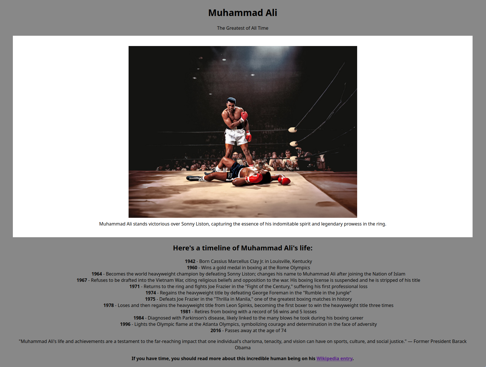

# Build a Tribute Page

For this project, you will build a tribute page for a subject of your choosing, fictional or real.

**Objective:**  
Build an app that is functionally similar to [this tribute page](https://tribute-page.freecodecamp.rocks). Do not copy this demo project.

## User Stories:

1. Your tribute page should have a `main` element with a corresponding `id` of `main`, which contains all other elements.
2. You should see an element with an `id` of `title`, which contains a string (i.e., text) that describes the subject of the tribute page (e.g., "Dr. Norman Borlaug").
3. You should see either a `figure` or a `div` element with an `id` of `img-div`.
4. Within the `#img-div` element, you should see an `img` element with a corresponding `id="image"`.
5. Within the `#img-div` element, you should see an element with a corresponding `id="img-caption"` that contains textual content describing the image shown in `#img-div`.
6. You should see an element with a corresponding `id="tribute-info"`, which contains textual content describing the subject of the tribute page.
7. You should see an `a` element with a corresponding `id="tribute-link"`, which links to an outside site that contains additional information about the subject of the tribute page. **HINT:** You must give your element an attribute of `target` and set it to `_blank` in order for your link to open in a new tab.
8. Your `#image` should use `max-width` and `height` properties to resize responsively, relative to the width of its parent element, without exceeding its original size.
9. Your `img` element should be centered within its parent element.

Fulfill the user stories and pass all the tests below to complete this project. Give it your own personal style. Happy Coding!

**Note:**  
Be sure to add `<link rel="stylesheet" href="styles.css">` in your HTML to link your stylesheet and apply your CSS.

## Tests:

- **Passed:** 1. You should have a `main` element with an `id` of `main`.
- **Passed:** 2. Your `#img-div`, `#image`, `#img-caption`, `#tribute-info`, and `#tribute-link` should all be descendants of `#main`.
- **Passed:** 3. You should have an element with an `id` of `title`.
- **Passed:** 4. Your `#title` should not be empty.
- **Passed:** 5. You should have a `figure` or `div` element with an `id` of `img-div`.
- **Passed:** 6. You should have an `img` element with an `id` of `image`.
- **Passed:** 7. Your `#image` should be a descendant of `#img-div`.
- **Passed:** 8. You should have a `figcaption` or `div` element with an `id` of `img-caption`.
- **Passed:** 9. Your `#img-caption` should be a descendant of `#img-div`.
- **Passed:** 10. Your `#img-caption` should not be empty.
- **Passed:** 11. You should have an element with an `id` of `tribute-info`.
- **Passed:** 12. Your `#tribute-info` should not be empty.
- **Passed:** 13. You should have an `a` element with an `id` of `tribute-link`.
- **Passed:** 14. Your `#tribute-link` should have an `href` attribute and value.
- **Passed:** 15. Your `#tribute-link` should have a `target` attribute set to `_blank`.
- **Passed:** 16. Your `img` element should have a `display` of `block`.
- **Passed:** 17. Your `#image` should have a `max-width` of `100%`.
- **Passed:** 18. Your `#image` should have a `height` of `auto`.
- **Passed:** 19. Your `#image` should be centered within its parent.

 

